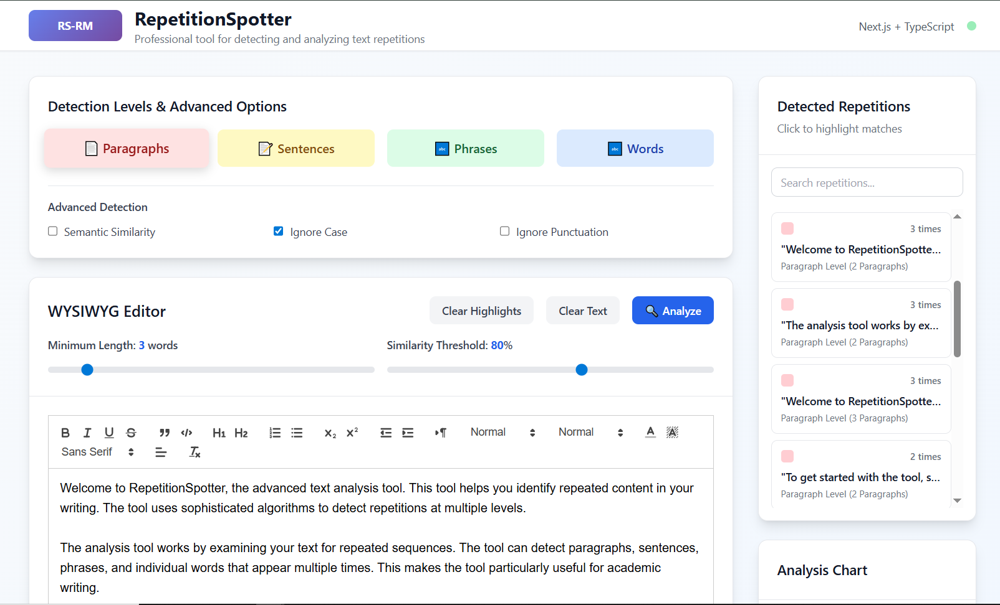
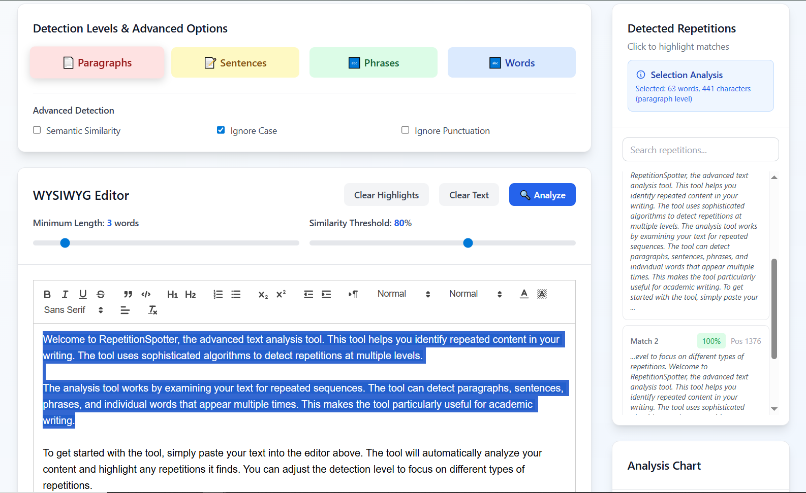
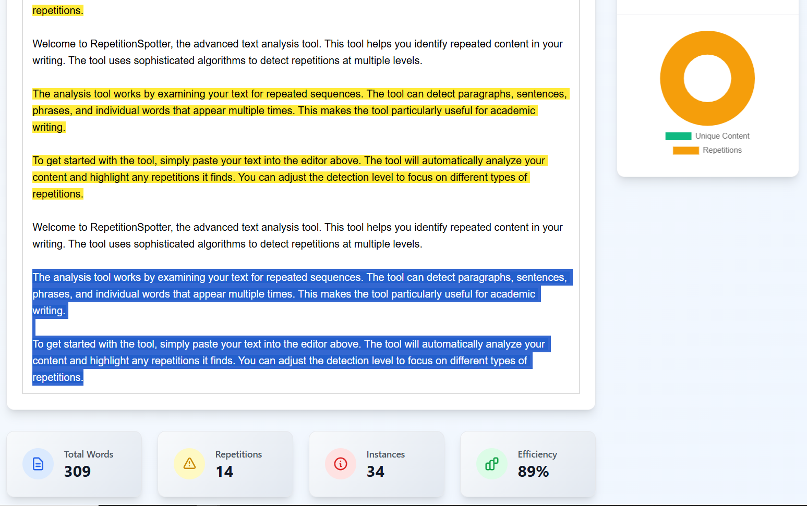

# RepetitionSpotter


### 🔍 Advanced Text Analysis Tool for Content Optimization

A sophisticated web application that detects and visualizes text repetitions with VSCode-style highlighting and multi-level analysis capabilities.

[🚀 Live Demo](https://repetition-spotter.vercel.app/) • [✨ Features](#-features) • [📦 Installation](#-installation) • [📖 Usage](#-usage)

[](https://repetition-spotter.vercel.app/)

## 📑 Table of Contents

- [🌟 Overview](#-overview)
  - [🎯 Key Benefits](#-key-benefits)
- [✨ Features](#-features)
  - [🔍 Multi-Level Detection](#-multi-level-detection)
  - [🎨 Advanced Analysis](#-advanced-analysis)
  - [📊 Comprehensive Reporting](#-comprehensive-reporting)
  - [🛠️ Professional Tools](#-professional-tools)
- [🚀 Live Demo](#-live-demo)
- [📦 Installation](#-installation)
  - [Prerequisites](#prerequisites)
  - [Quick Start](#quick-start)
  - [Production Build](#production-build)
- [📖 Usage](#-usage)
  - [Basic Analysis](#basic-analysis)
  - [Advanced Configuration](#advanced-configuration)
  - [Detection Levels Explained](#detection-levels-explained)
- [🏗️ Architecture](#-architecture)
  - [Technology Stack](#technology-stack)
- [🤝 Contributing](#-contributing)
  - [Development Guidelines](#development-guidelines)
- [👨‍💻 Author](#-author)
- [🙏 Acknowledgments](#-acknowledgments)

---

## 🌟 Overview

RepetitionSpotter is a powerful text analysis tool designed for writers, editors, and content creators who need to identify and eliminate redundant content. Built with modern web technologies, it provides real-time analysis with an intuitive interface inspired by VSCode's highlighting system.

### 🎯 Key Benefits

- **Academic Writing**: Perfect for research papers, theses, and scholarly articles
- **Content Creation**: Optimize blog posts, articles, and marketing copy
- **Editorial Review**: Streamline the editing process with visual repetition detection
- **SEO Optimization**: Improve content quality by reducing redundancy

## ✨ Features

### 🔍 Multi-Level Detection

- **Paragraph Level**: Detect repeated paragraphs and multi-paragraph sequences
- **Sentence Level**: Identify duplicate sentences across your document
- **Phrase Level**: Find repeated phrases with customizable minimum length
- **Word Level**: Analyze word-level repetitions and sequences

### 🎨 Advanced Analysis

- **Semantic Similarity**: AI-powered detection of similar content with different wording
- **VSCode-Style Highlighting**: Professional visual feedback with color-coded levels
- **Real-time Selection Analysis**: Instant feedback on selected text repetitions
- **Customizable Thresholds**: Adjust sensitivity and minimum length requirements

### 📊 Comprehensive Reporting

- **Interactive Statistics**: Real-time metrics on content efficiency
- **Visual Charts**: Doughnut charts showing content composition
- **Detailed Breakdown**: Count and categorize all detected repetitions
- **Export Capabilities**: Save analysis results for future reference

### 🛠️ Professional Tools

- **WYSIWYG Editor**: Rich text editing with full formatting support
- **Search & Filter**: Quickly find specific repetitions in large documents
- **Responsive Design**: Works seamlessly on desktop, tablet, and mobile
- **Component Architecture**: Modular Next.js structure for maintainability

## 🚀 Live Demo

Experience RepetitionSpotter in action: **[repetition-spotter.vercel.app](https://repetition-spotter.vercel.app/)**

## 📦 Installation

### Prerequisites

- Node.js 18.0 or higher
- npm or yarn package manager

### Quick Start

```bash
# Clone the repository
git clone https://github.com/hesbon-osoro/repetition-spotter.git

# Navigate to project directory
cd repetition-spotter

# Install dependencies
yarn install

# Start development server
yarn run dev
```

Open [http://localhost:3000](http://localhost:3000) to view the application.

### Production Build

```bash
# Build for production
yarn run build

# Start production server
yarn start
```

## 📖 Usage

### Basic Analysis

1. Paste or type your text into the rich text editor
2. Select detection level (Paragraph, Sentence, Phrase, or Word)
3. Click "Analyze" to detect repetitions
4. Review results in the sidebar with visual highlighting

### Advanced Configuration

**Detection Settings**

```ts
interface AnalysisSettings {
  minLength: number; // Minimum words for detection (1-20)
  similarityThreshold: number; // Similarity percentage (50-100%)
  semanticSimilarity: boolean; // Enable AI-powered similarity
  ignoreCase: boolean; // Case-insensitive matching
  ignorePunctuation: boolean; // Ignore punctuation marks
}
```

**Selection Analysis**

- Select any text to see instant repetition analysis
- View context for each detected match
- Navigate between matches with click-to-scroll functionality

**Detection Levels Explained**

| Level     | Description                               | Use Case                               |
| --------- | ----------------------------------------- | -------------------------------------- |
| Paragraph | Detects repeated paragraphs and sequences | Academic papers, long-form content     |
| Sentence  | Identifies duplicate sentences            | Editorial review, content optimization |
| Phrase    | Finds repeated phrases (3+ words)         | Marketing copy, technical writing      |
| Word      | Analyzes word sequences and patterns      | Detailed linguistic analysis           |

## 🏗️ Architecture

### Technology Stack

- **Frontend**: Next.js 14, React 18, TypeScript
- **Styling**: Tailwind CSS, Custom CSS animations
- **Editor**: Quill.js rich text editor
- **Charts**: Chart.js with React integration
- **Deployment**: Vercel with automatic CI/CD

## 🤝 Contributing

We welcome contributions!

1. Fork the repository
2. Create a feature branch: `git checkout -b feature/amazing-feature`
3. Commit changes: `git commit -m 'Add amazing feature'`
4. Push to branch: `git push origin feature/amazing-feature`
5. Open a Pull Request

### Development Guidelines

- Follow TypeScript best practices
- Maintain component modularity
- Add tests for new features
- Update documentation as needed

## 👨‍💻 Author

**Hesbon Osoro**

- GitHub: [hesbon-osoro](https://github.com/hesbon-osoro)
- LinkedIn: [hesbon-osoro](https://linkedin.com/in/hesbon-osoro)

## 🙏 Acknowledgments

- [Quill.js](https://quilljs.com/) for the rich text editor
- [Chart.js](https://www.chartjs.org/) for data visualization
- [Tailwind CSS](https://tailwindcss.com/) for styling system
- [Vercel](https://vercel.com/) for hosting and deployment

## 📸 Screenshots

[](https://repetition-spotter.vercel.app/)

[](https://repetition-spotter.vercel.app/)

[](https://repetition-spotter.vercel.app/)
